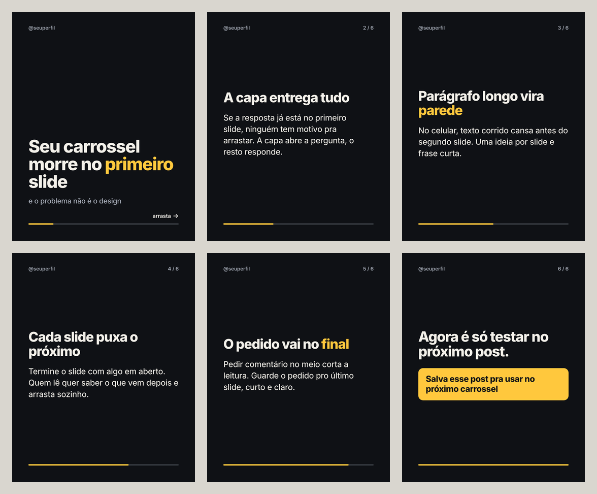

# arrasta

Você escreve o tema e sai com o carrossel de Instagram pronto pra postar.



Esse aí em cima saiu de [`exemplos/exemplo.json`](exemplos/exemplo.json) com um comando. Os slides em tamanho real estão em [`exemplos/exemplo/`](exemplos/exemplo/).

## Antes de instalar

**O que você precisa ter**

- Um Mac e internet na hora de instalar. O arrasta foi testado no Mac; Windows e Linux ainda não foram testados.
- Python 3.12 ou mais novo. Para conferir, rode `python3 --version`. Se não tiver, baixe em [python.org](https://www.python.org/downloads/).
- Git, para baixar o arrasta ([git-scm.com](https://git-scm.com/downloads)).
- Cerca de 500 MB livres. A maior parte é o navegador (o Chromium) que o arrasta usa só para desenhar os slides.

**A ferramenta é grátis. A IA é sua.**

Quem escreve o texto dos slides é uma IA, e essa IA é sua. O arrasta roda no seu computador, não tem conta nem servidor e não cobra nada. Você escolhe como usar:

- **Sem chave, de graça:** o arrasta monta o prompt, você cola em qualquer IA (ChatGPT, Claude, Gemini, inclusive no plano grátis) e traz a resposta de volta. O arrasta confere a resposta e gera os slides.
- **Com a sua chave da OpenAI ou da Anthropic, num comando só:** o arrasta pede o texto direto à IA, confere e gera os slides. A chave é sua, criada em [platform.openai.com](https://platform.openai.com/api-keys) ou em [console.anthropic.com](https://console.anthropic.com), e cada carrossel é cobrado na sua conta dessa empresa ([preços da OpenAI](https://openai.com/api/pricing), [preços da Anthropic](https://www.anthropic.com/pricing)). O arrasta lê a chave do seu computador e só a envia para a empresa dona dela.

**O primeiro comando**, depois de instalar, gera o carrossel de exemplo, sem IA e sem chave:

```
arrasta render exemplos/exemplo.json
```

**Onde saem os arquivos:** na pasta `saida/`, dentro da pasta do arrasta, uma subpasta por carrossel. O exemplo sai em `saida/exemplo/`:

| arquivo | o que é |
|---|---|
| `01.png`, `02.png`, ... | um PNG por slide, 1080 x 1350 (o formato retrato do feed do Instagram), na ordem do carrossel |
| `previa.png` | todos os slides lado a lado, para ver o carrossel inteiro de uma vez |
| `slides.json` | o texto que gerou os slides; edite e gere de novo quando quiser |

## Instalar

No terminal, um comando por vez:

```
git clone https://github.com/artfacasmarketing-sudo/arrasta.git
cd arrasta
python3 -m venv .venv
source .venv/bin/activate
pip install -e .
playwright install --only-shell chromium
```

Pronto. Rode o primeiro comando:

```
arrasta render exemplos/exemplo.json
```

e abra `saida/exemplo/previa.png`.

Da próxima vez que abrir o terminal, entre na pasta e ative o ambiente antes de usar: `cd arrasta` e `source .venv/bin/activate`.

## Seu carrossel

### Sem chave (grátis)

```
arrasta tema "por que o cliente some depois do orçamento" --arroba @seuperfil
```

O arrasta mostra o prompt e diz o que fazer:

1. Copie o prompt (ele também fica salvo em `saida/<tema>/prompt.txt`).
2. Cole numa conversa nova de qualquer IA.
3. Salve a resposta inteira da IA no arquivo `saida/<tema>/resposta.txt`.
4. Rode `arrasta montar saida/<tema>/resposta.txt`.

Se a resposta quebrar alguma regra, o arrasta mostra qual e escreve em `correcao.txt` o texto para você colar na mesma conversa da IA. Salve a nova resposta no mesmo `resposta.txt` e rode o passo 4 de novo.

### Com a sua chave da OpenAI ou da Anthropic (um comando)

Guarde a chave no terminal (ela fica só no seu computador). Use a linha da empresa da sua chave:

```
export OPENAI_API_KEY=sua-chave
export ANTHROPIC_API_KEY=sua-chave
```

Depois é um comando só:

```
arrasta tema "por que o cliente some depois do orçamento" --arroba @seuperfil
```

O arrasta pede o texto à IA, confere as regras, pede correção se precisar (até 3 vezes) e grava os PNGs em `saida/<tema>/`.

| chave no ambiente | IA usada | modelo padrão |
|---|---|---|
| `OPENAI_API_KEY` | OpenAI | `gpt-6-astra` |
| `ANTHROPIC_API_KEY` | Anthropic | `claude-opus-5` |
| as duas | OpenAI (troque com `--ia anthropic`) | o da IA escolhida |
| nenhuma | nenhuma: o arrasta monta o prompt para você colar | |

Para gastar menos, escolha um modelo menor com `--modelo`, por exemplo `--modelo gpt-5.4-mini` ou `--modelo claude-sonnet-5`.

### Opções

| opção | para quê |
|---|---|
| `--arroba @seuperfil` | seu @ no topo de cada slide |
| `--publico "casais montando o primeiro apartamento"` | pra quem é o carrossel; a IA escreve pensando nessa pessoa |
| `--slides 8` | quantos slides, de 5 a 10 (padrão 7) |
| `--saida pasta` | outra pasta de saída |
| `--ia openai` ou `--ia anthropic` | qual chave usar quando as duas estão no ambiente |
| `--modelo nome` | outro modelo da IA escolhida |

### Escrevendo você mesmo

Copie `exemplos/exemplo.json`, troque os textos e rode:

```
arrasta render meu-carrossel.json
```

## O formato do slides.json

```json
{
  "arroba": "@seuperfil",
  "visual": "escuro",
  "slides": [
    {"tipo": "capa", "titulo": "A frase que faz arrastar", "texto": "apoio curto, opcional"},
    {"tipo": "miolo", "titulo": "Uma ideia por slide", "texto": "O texto que explica a ideia."},
    {"tipo": "final", "titulo": "A frase que fecha.", "pedido": "Salva esse post pra usar depois"}
  ]
}
```

- `tipo`: `capa` no primeiro slide, `final` no último, `miolo` no meio.
- `*palavra*` fica na cor de destaque (até 2 destaques por slide).
- `visual`: `escuro` ou `claro`.
- `cores` (opcional) troca as cores do visual, por exemplo `"cores": {"destaque": "#22c55e"}`. As chaves são `fundo`, `texto`, `texto2`, `destaque` e `sobre_destaque`. Se a cor não tiver contraste para ler, o arrasta recusa e diz qual.

## As regras

Todo carrossel passa por estas regras antes de virar PNG. Veja a qualquer hora com `arrasta regras`.

1. **Estrutura:** de 5 a 10 slides. Capa primeiro, miolo no meio, final por último.
2. **Gancho na capa:** título com até 12 palavras e apoio com até 10.
3. **Pouco texto por slide:** no miolo, título com até 8 palavras e até 30 palavras no slide.
4. **Pedido no lugar certo:** o pedido (comentar, salvar, mandar pra alguém) só no último slide, com até 12 palavras, e o último slide com até 25 palavras.
5. **Escrita:** sem emoji, sem travessão, sem hashtag, sem link e sem clichê de guru.
6. **Número com fonte:** quando o texto vem da IA, todo número nos slides tem de estar no tema que você escreveu. A IA não inventa estatística.
7. **Cabe na caixa:** a letra nunca encolhe para caber. Se o texto não cabe, o slide é recusado e você encurta.

O que a máquina não mede (se o gancho prende de verdade, se a ordem conta uma história) vai como orientação no prompt e fica com a sua leitura.

## Testes

```
pip install -e ".[testes]"
pytest
```

Os testes plantam um defeito de cada tipo (texto demais, pedido no meio, cor sem contraste, fonte que não carrega, letra que a fonte não tem) e conferem que o arrasta recusa cada um. O caminho com chave, da OpenAI e da Anthropic, é testado contra um servidor falso local, sem gastar nada.

## Licença

Código sob a licença MIT ([LICENSE](LICENSE)). A fonte Inter vai junto sob a SIL Open Font License ([arrasta/modelo/fontes/OFL.txt](arrasta/modelo/fontes/OFL.txt)).
